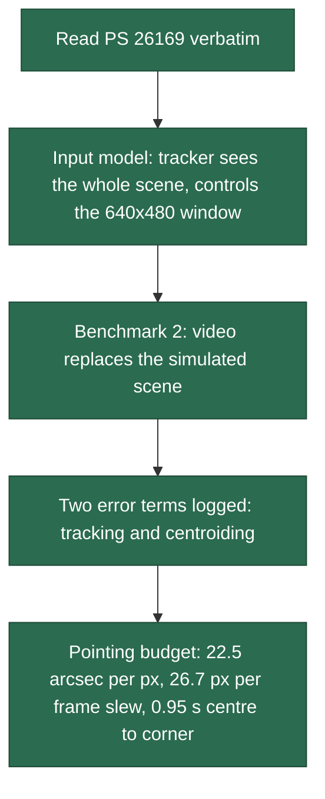
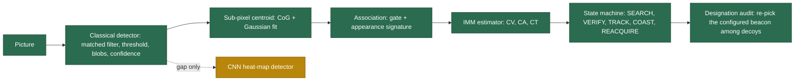
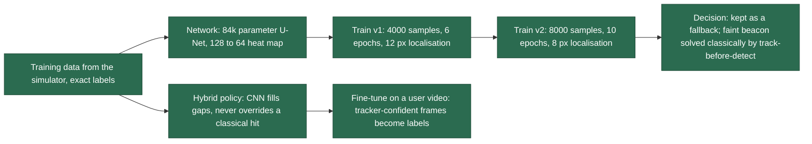
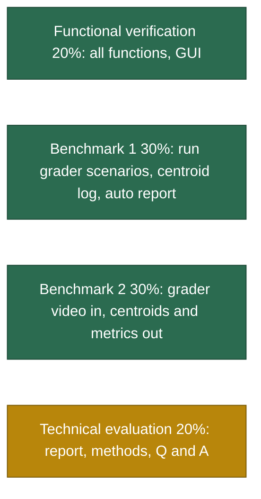

# Progress Pipeline

ARGUS for **SIH26169** (Department of Space / ISRO SAC): AI-based virtual camera tracking
system for coarse alignment of mobile FSOC terminals.

Colour key used in every diagram and table below:

| Colour | Status |
|---|---|
| 🟩 green | Done and verified |
| 🟨 amber | In progress or partly done |
| 🟥 red | Blocked or failing |
| ⬜ grey | Not started |

Last updated: 2026-09-23

---

## 1. The pipeline at a glance

---

## 2. Stage by stage

### 2.1 Understanding the problem  🟩

**What exists today and what goes wrong.** Satellites, drones and ground stations mostly talk
over radio: reliable but slow, licensed, and open to interference. FSOC sends data on a laser
beam instead: gigabit to terabit rates, no licence, immune to interference. The catch is
aiming. A laser is a thin pencil of light, both ends move, so the terminals must keep finding
and following each other (PAT). Coarse alignment gets the beacon into the camera's view;
fine alignment locks the beam. This project is the coarse stage. Building and testing it on
real hardware needs an expensive camera, pan-tilt mount and optics, and on hardware you can
neither order fog on demand, nor know the beacon's true position, nor repeat a test exactly.

**What goes in, what comes out.** The tracker looks at the whole scene picture (the 2000 x 2000
screen with beacon and disturbances). It controls the 640 x 480 camera window, which stands
for where the terminal points and can turn at most 5 to 10 degrees per second. Three
situations: your own run (settings in, live display and report out), Benchmark 1 (grader
scenario files in, centroiding log and report out), Benchmark 2 (grader .mp4 in, per-frame
centre points, RMSE, acquisition and re-acquisition times, lock retention and FPS out).

**Why build our own scene when graders supply a video.** It is a mandatory deliverable (the
first four "shall" items and parameter rows 1 to 15), Benchmark 1 cannot run without it, we
will not have their video while building, and only our own scene knows the true answer.

### 2.2 Simulator  🟩

| Item | Status | Notes |
|---|---|---|
| Scene 2000 x 2000 with starfield, terrain, gradient, flat | 🟩 | rows 1, 2 |
| Beacon shapes square, circle, gaussian, cross, ring, diamond, custom (0/1 mask or PNG); width and height set separately, 5-20 x 5-20 px | 🟩 | rows 7 to 10; one sprite module for renderer and detector, the three original shapes byte-identical to before |
| Named targets; start random, centre or typed x,y in the panel | 🟩 | rows 8, 11 |
| Paths: line, circular, figure of 8, random, spiral, sinusoidal | 🟩 | row 12; line turns back smoothly at edges |
| Rate-limited gimbal with acceleration limit and latency | 🟩 | rows 13 to 15; window centre can reach any screen pixel |
| Disturbances in physical order: extinction, turbulence, blur, platform sway, vibration, Poisson, Gaussian, salt and pepper | 🟩 | rows 21 to 25; sway amplitude capped at 20% of screen so the beacon stays in the field; the figure-8 sway scaled so its peak equals the setting (it peaked at 28.3 px/frame at 20); every pattern within the PS +/-20 px/frame |
| Atmosphere presets clear, haze, fog, rain, low light | 🟩 | row 24 |
| Ground truth per frame, deterministic from (scenario, seed) | 🟩 | |
| Colour camera option | 🟩 | row 2; tracker uses luminance |

### 2.3 Tracker  🟩

| Item | Status | Measured |
|---|---|---|
| Centroiding accuracy | 🟩 | 0.006 to 0.007 px clear, 0.08 to 0.15 fog and low light, 0.19 heavy noise |
| Acquisition | 🟩 | 0.30 to 2.00 s over the measured full-view scenarios (spec 2 s) |
| Vibration handled as measurement noise, not motion | 🟩 | innovation-based, capped at 25 px |
| Identity among decoys | 🟩 | one seed in five swaps in the hardest stress case |
| Designation of the target to follow: appearance, start cue or point cue (click or typed); the designated target is the one scored; ambiguous frames counted | 🟩 | row 8; identical decoys starting apart: 1 of 5 runs acquired by appearance only, 5 of 5 with the start cue |
| Coded beacon (beyond the PS): the designated beacon blinks a bit pattern; a spot is accepted only when it blinks it, rejected spots are set aside, the check keeps running in TRACK | 🟩 | `coded_beacon`, three identical look-alikes and no cue: on the beacon 100% of the locked time on seeds 0 to 2 (a look-alike on 2 of 3 without the code) |
| Search re-measures candidates on the current frame (was a stale or missing picture after a loss; a crash at 50% salt and pepper) | 🟩 | regression batch unchanged: 42 of 42 runs identical |
| Hard mode (tracker sees only the window) | 🟩 | square-spiral search; acquisition 2.83 to 11.97 s, physics-limited |
| Coasting guard: an estimate more than 160 px outside the picture while coasting or re-acquiring sends the tracker back to a whole-scene search | 🟩 | lowlight_faint seed 2, 30 s: 158 px, 75.1% lock, re-acquisition 4.53 s before; 5.9 px, 96.2%, 0.07 s after |
| Faint-path chain linking vectorised (same greedy order, identical results) | 🟩 | lowlight_faint 30 s: 99th-percentile frame 149 to 160 ms before, 26 to 33 ms after; true FPS 68 to 81 before, 95 to 96 after |
| Faint-track guards: the raw detection is kept when the refit moves more than 3 px or its width exceeds 2.5 times the track's recent median; much wider candidates are not associated; the CNN is not used on a faint track | 🟩 | lowlight_faint seed 7: 86 px, 78.6% lock before; 2.8 px, 94.8% after |

### 2.4 Controller  🟩

| Item | Status |
|---|---|
| Feedforward of velocity and acceleration, PI on error (kp 5, kd 0, ki 0.8), latency lead for target and window | 🟩 |
| Derivative removed (kd 0.3 to 0): on an error that arrives a frame late in whole pixels it drove a +/-10 px limit cycle; a still beacon went from mean 6.4 px, peak 15.6 px to within 4 px (mean 1.6 px) | 🟩 |
| Deadband and integrator clamping | 🟩 |
| Saturation reported per frame | 🟩 |
| Turn-limited lead: the 0.25 s acceleration lead capped so the path turns at most 0.1 rad over it | 🟩 |

### 2.5 Measured performance (15 s runs)  🟩

| Scenario | Tracking error | Lock | Status |
|---|---|---|---|
| Clear line / circle / figure of 8 | 2.1 to 3.7 px | 100% | 🟩 acquisition 0.60 to 1.33 s |
| Clear random | 5.1 to 6.3 px | 100% | 🟩 acquisition 0.67 to 1.03 s |
| Noise: 10% salt and pepper, sigma 20, Poisson | 2.4 to 3.7 px | 100% | 🟩 acquisition 0.67 to 1.00 s |
| Fog and low light | 2.5 to 3.7 px | 100% | 🟩 acquisition 0.63 to 1.57 s |
| Platform sway 12 px/f + vibration 20 px/f | 19.0 to 19.4 px raw | 99.3 to 100% | 🟥 physical limit: a random per-frame jitter cannot be cancelled before the frame arrives; the vibration-removed error is reported alongside |
| Platform at PS maximum 20 + 20 px/f, at 5 and 10 deg/s | 21.7 to 23.5 px | 93.4 to 97.2% | 🟥 physical limit: measured the same at the allowed 10 deg/s (slew saturation 2%), so the random 20 px per-frame vibration is the limit, not the motor |
| Multi-target stress with haze, noise, sway | 10.3 to 11.3 px | 98.2 to 100% | 🟩 identity held on every seed (fitted width, refined association, frozen signature at crossings) |
| Hard mode | 2.6 to 3.7 px after acquisition | 100% | 🟩 acquisition 2.83 to 11.97 s (search, by design) |
| Identical decoys, designation start | 3.3 to 3.5 px | 100% | 🟩 |
| Beacon shapes: 8 x 18 px rectangle among other shapes | 2.6 to 3.1 px | 100% | 🟩 |
| Coded beacon among identical look-alikes, no cue (30 s) | 1.9 to 2.3 px | 100% | 🟩 acquisition 0.97 to 1.87 s; beyond the PS |
| Faint beacon at 3 to 6 sigma, 10 seeds | 2.4 to 3.5 px | 94.0 to 97.8%; seeds 7 and 8 at 94.8 and 94.0%, just above the 5% loss limit | 🟩 track-before-detect on a moving-target residual; acquisition 0.80 to 2.00 s |
| Fast circle: 450 px at 4 deg/s, 80% of the turn rate (seeds 0 to 2) | 4.6 to 5.3 px | 100% | 🟩 acquisition 0.67 to 0.70 s; was 34.3 px at 14 to 19% lock before the turn-limited lead |

Processing: 69 to 216 FPS at 2000 x 2000 on a laptop CPU (16-scenario pack) (spec 20). FPS is frames over processing
time (1000 / mean ms); the mean of per-frame rates is kept as `fps_inst_mean` for comparison only.

### 2.6 Instrumentation  🟩

| Item | Status |
|---|---|
| `frames.csv`, one row per frame, about 45 columns | 🟩 |
| `summary.json` with every metric and its printed definition, pass/fail against PS rows 16 to 20 | 🟩 |
| `report.pdf`: spec check with the Targets and Followed lines and the scenario check notes, time series, paths and histograms; text wrapped line by line, metrics list continued on a second page | 🟩 |
| `summary.json` carries `designation` and `checks` | 🟩 |
| Vibration-removed tracking error alongside the raw one | 🟩 |
| `fps_mean` as frames over processing time; the old mean of per-frame rates kept as `fps_inst_mean` (faint seed 2, 30 s: 92.0 said, 67.8 true) | 🟩 |
| Benchmark 2 ground truth: a CSV of frame or t, x, y (`--truth`, Truth CSV on both front ends, or `<video>_truth.csv` beside the video) gives tracking and centroiding error, RMSE and true lock; the report's source line names it | 🟩 |
| Batch runner with multi-seed envelope table | 🟩 |

### 2.7 Desktop application  🟩

| Item | Status |
|---|---|
| Parameter panel, one control per PS row, tooltips naming the row | 🟩 |
| Scenario picker, speed control, keyboard shortcuts | 🟩 |
| Live specification tiles (green / amber) | 🟩 |
| Scene view with 2 degree grid, trails, legend | 🟩 |
| Camera view with capture ring, error vector, prediction, scale bar | 🟩 |
| Four live plots with legends | 🟩 |
| Benchmark 2 video ingest, with first-frame preview and file facts on load | 🟩 |
| Disturbances changed during a run (live panel, or `schedule` in a scenario); per-setting figures in the report; replayable | 🟩 |
| New random seed and heading each run, with a pin option; a loaded scenario keeps its own | 🟩 |
| Automatic report on finish, open report / folder; advice when the gimbal was rate-limited | 🟩 |
| Run section: Identical look. Target section: target picker and a Designated tick box, designation mode automatic; preview at t = 0 with named targets, click to designate; click a video's first frame to cue | 🟩 |
| Scenario check shown live, at Start, in the end dialog, in the report and the summary: Corrected, Beyond the PS, Near the limit, Cannot be met | 🟩 |
| Truth CSV toolbar button in video mode (desktop and web) | 🟩 |
| Salt and pepper in percent on both panels; every numeric input clamped in the engine (the web page had taken 13 as a fraction) | 🟩 |
| Video mode: target appearance (name, shape, width, height, mask, intensity) editable; motion locked | 🟩 |

### 2.8 Tests  🟩

126 tests: geometry, gimbal limits, every motion type on screen and deterministic, centroid
accuracy, sub-pixel refinement, IMM prediction, re-acquisition metric, closed loop clear, closed
loop with vibration, multi-target identity, 3 and 8 decoys, video path, desktop panel (video
runs the whole file, a loaded scenario keeps its seed), PS rows, and targets (width and height,
every shape, clamping and PS-envelope notes, physical-limit note, percent display, identical
extra targets, the designated target is scored, identical decoys need a cue, typed start), and
the review fixes (FPS is frames over processing time, a 4 deg/s target is kept centred, a coasting
estimate cannot run off the screen, video ground truth gives errors, the CNN model is found from
any folder), and the PS audit fixes (a still beacon centred without oscillation, platform sway
never above the set speed, a faint track not walked off by noise), and live disturbance changes
(timing, exact replay from the saved scenario, no platform jump, video runs refuse changes, the
desktop panel and the web API). 126 of 126 pass locally, including the shared chat history finding every teammate's sessions, the coded beacon (code read and compared, look-alikes turned down, a wrong click corrected, a spot that stops blinking handed back, check notes), the camera effects (frame loss, exposure), the baseline comparison, the handoff-to-fine-pointing indicator, `fsoc-tracker verify` (a run's summary rebuilt from its frames.csv; a
tampered summary is caught) and the robustness review of 2026-09-24 (start cue,
video truth gaps, sprite centres, malformed input, launcher, record check, web input and control).
Regression batch over the 16-scenario pack against the previous commit: 0 worse, 5 better
(platform maximum lock), every other run in its "same" band, although tracking errors dropped by
about two thirds (the tool flags error increases, not decreases).

PS audit (`tools/ps_audit.py`): every PS row, "shall" item, deliverable and both benchmarks
measured by running the code, written to `docs/PS_AUDIT.md`: 39 of 39 pass. It runs in the build
workflow on the Linux job ("PS audit" step) and is in `CONTRIBUTING.md` and the pull-request
template.

### 2.9 AI detector  🟨

Honest state: the CNN is a gap filler. In the standard scenarios the classical pipeline carries the load and the CNN supplies 0%
of measurements; on a real phone video it supplied half of them. The faint-beacon case is now handled classically (chains of weak detections on a moving-target residual), so the CNN stays a gap filler.
`training/finetune_from_video.py` adapts it to footage you provide (self-training from the tracker's confident frames).
The model path is also looked up from the package folder, so an installed command started from another folder still loads it.

### 2.10 Executable builds  🟩

Windows and Linux are built by `.github/workflows/build.yml` (run by hand or on a tag). Each job installs the
project, runs the 126 tests (and, on Linux, the PS audit), the web app smoke test, packages with PyInstaller and
runs the packaged executable on a scenario before uploading the archive; `bash webapp/publish_builds.sh` puts the
archives on the site. The macOS Intel and Apple silicon archives are built by `bash tools/build_macos.sh` on the
team's Apple silicon Mac (Intel through Rosetta) with the same checks, and uploaded by it. The 2026-09-23 macOS
archives on the site are current; Windows and Linux await an Actions budget or the monthly reset.

The four-platform run below predates the 2026-09-23 changes and will be repeated for them.

| Target | Runner | Status |
|---|---|---|
| Windows x64 (`ARGUS-windows-x64.zip`, with `ARGUS-cli.exe`) | windows-latest | 🟩 tests, web smoke and packaged smoke passed on the runner; archive contents inspected |
| Linux x64 (`ARGUS-linux-x64.tar.gz`, glibc of Ubuntu 22.04) | ubuntu-22.04 | 🟩 tests, web smoke and packaged smoke passed on the runner; archive contents inspected |
| macOS Intel (`ARGUS-macos-intel.zip`) | macos-15-intel | 🟩 runner checks passed; archive also run by hand under Rosetta 2: two scenarios, video mode, GUI start |
| macOS Apple silicon (`ARGUS-macos-arm64.zip`) | macos-14 | 🟩 runner checks passed; archive also run by hand natively: two scenarios, video mode, GUI start |

Native code per platform is unavoidable: the bundles carry NumPy, OpenCV, SciPy, Qt and ONNX Runtime.
The web app is the architecture-neutral path.

### 2.11 Documents  🟩

| Document | Status |
|---|---|
| `COMPLIANCE.md`, point-by-point check of every PS row, shall item, deliverable and evaluation stage, backed by `tests/test_ps_compliance.py` | 🟩 |
| Progress website (`web/`), served from the project server at /about/ | 🟩 |
| Web app (`webapp/`), same engine in the browser, served at the project site root with a desktop download prompt | 🟩 |
| Desktop builds for Windows x64, Linux x64, macOS Intel and Apple silicon (`.github/workflows/build.yml`, tests and smoke test per OS) | 🟩 |
| `docs/USER_MANUAL.md` and `.pdf` | 🟩 |
| `docs/TECHNICAL_REPORT.md` and `.pdf` | 🟩 performance table filled from the measured envelope |
| `ARCHITECTURE.md` | 🟩 |
| `docs/PS_AUDIT.md`, generated by `tools/ps_audit.py`: every PS item measured, 39 of 39 pass | 🟩 |
| Deck renamed ARGUS, full form on slide 1: `docs/submission/ARGUS_SIH2026_26169.pdf` (the site also serves the old name) | 🟩 |
| `docs/plan.html` (plain-English briefing, open locally in a browser) | 🟩 |
| Demo video, 3 to 5 min (optional in the PS) | ⬜ |

### 2.12 Submission  🟨

| Item | Status |
|---|---|
| Source with documentation | 🟩 |
| Standalone executable for the evaluators' machines | 🟩 four archives on the project site |
| Technical report 10 to 15 pages, exported | 🟩 13-page PDF |
| User manual, exported | 🟩 PDF, per-platform installation |
| Web app for review without installation | 🟩 project site, login protected |
| Demo video (optional) | ⬜ narration script ready (`docs/DEMO_NARRATION.md`); recording left to the team |
| Rehearsed 10 to 15 minute live demo script | ⬜ |

---

## 3. Where the marks are, and where we stand

Benchmark 1 and 2 are marked green because the mechanisms exist and are tested; the grader
files themselves arrive at judging.

---

## 4. Key numbers behind the design

One assumption: one screen pixel equals one camera pixel, so the 2000 px screen is 12.5 degrees.

| Quantity | Value |
|---|---|
| One pixel | 22.5 arcsec (4 deg / 640 px) |
| Allowed tracking error | 10 px = 0.0625 deg |
| Window motion at 5 deg/s, 30 Hz | 26.7 px per frame |
| Platform motion at PS maximum | 20 px per frame = 75% of the slew budget |
| Windows per screen | about 13 |
| Centre to corner, target known | 0.95 s |

---

## 5. Open items, in priority order

1. 🟩 CNN kept as a fallback; report's performance table filled from the measured envelope.
2. 🟩 Windows and Linux builds from the build workflow, macOS Intel and Apple silicon from `tools/build_macos.sh`, package-checked on each platform.
3. 🟩 Technical report and user manual exported to PDF; demo video composed from the engine (`tools/make_demo_video.py`); demo script in `docs/DEMO_SCRIPT.md`.
4. 🟩 Multi-target identity: candidates ranked by fitted width (noise-independent) instead of blob area; the stress seed that swapped now holds 99% lock.
5. 🟩 Faint beacon: track-before-detect on a moving-target residual; 10 seeds hold 94.0 to 97.8% lock, acquisition 0.80 to 2.00 s.
6. 🟩 PS row 8 designation, target names, shapes and separate width and height, typed start, scenario check, salt and pepper in percent with clamped inputs, video appearance fields, search fix.
7. 🟨 Repeat the four-platform build and package check for the 2026-09-23 changes, including the review fixes.
8. 🟩 Independent review by a teammate: fixed FPS metric, turn-limited lead, coasting guard, vectorised faint path, Benchmark 2 ground truth, independent read and shot noise planes, the Near the limit note, the CNN model path, a sway comment (20%, not 30%), and the new fast_circular scenario.
9. ⬜ Proposed, not required by the PS: switching the designated target mid-run (scored in segments), changing the scenario live during a run, manual camera control. Tracking every beacon at once was dropped as not required.
10. 🟩 PS audit tool (`tools/ps_audit.py`) and its CI step: 39 of 39. Fixes it led to: the derivative limit cycle (kd 0), the figure-8 sway above 20 px/frame, the faint-track guards. Deck renamed ARGUS.

### Review findings (2026-09-23)

An independent review by a teammate's session. Measured outcomes:

| Finding | Outcome |
|---|---|
| FPS was the mean of per-frame rates | fixed: frames over processing time; faint seed 2, 30 s: 92.0 said, 67.8 true |
| Fast targets lag | fixed in the controller, not the estimator (within 0.4 to 0.7 px of the truth): 4 deg/s circle 34.3 px to 8.4 px, 100% lock |
| Coasting estimate runs away | fixed: faint seed 2, 30 s, 158 px and 75.1% lock to 5.9 px and 96.2% |
| Faint search slow | fixed: 99th-percentile frame 149 to 160 ms to 26 to 33 ms |
| Tracker sees the whole scene | unchanged: the documented reading of the PS; hard mode covers the window-only reading; a wide-field finder remains future work |
| AI role small | unchanged: a gap filler, 0% of measurements in the standard scenarios |
| No Benchmark 2 ground truth | added: truth CSV; noisy_line clip, 4.85 px tracking, 0.188 px centroiding |
| Read and shot noise shared one random plane | fixed: independent planes; shot noise stays a Gaussian approximation of Poisson |
| Beacon above 70% of the turn rate labelled Cannot be met | fixed: new note Near the limit |
| 5 px beacon in rain with 10% salt and pepper never acquired, about 3 FPS | not reproduced: figure of 8, 30 s, seeds 0 to 2, 0.77 to 1.37 s, 6.0 to 6.5 px, 100% lock, 86 to 99 FPS |
| `tests/test_ps_compliance.py` mostly checks presence | noted, not changed: behaviour is covered by the other tests |

Regression batch (15 s, seeds 0 to 2) against the committed merge: 38 same, 10 better, 0 worse,
3 new. Better: platform_max, platform_max_10degs, lowlight_faint and platform_jitter seed 0.

### PS audit findings (2026-09-23 evening)

| Finding | Outcome |
|---|---|
| Shall 6: a still beacon was never settled; the derivative on a one-frame-late, whole-pixel error drove a +/-10 px limit cycle (mean 6.4 px, peak 15.6 px) | fixed: kd 0; held within 4 px (mean 1.6 px); tracking errors over the pack dropped by about two thirds |
| Row 25: the figure-8 sway peaked at 28.3 px/frame at a 20 setting | fixed: scaled so its peak equals the setting; every pattern within +/-20 px/frame |
| Faint beacon seed 7: the refit slid onto noise clumps, the track walked off (86 px, 78.6% lock) | fixed: refit and width guards, no CNN on a faint track; 2.8 px, 94.8% |

Regression batch (15 s, seeds 0 to 2) against the previous commit: 0 worse, 5 better (platform
maximum lock), every other run in its "same" band.

Known limit: look-alikes that start at the same point as the designated beacon cannot be told apart at the start; even with the start cue those runs held 8 to 25% lock.
