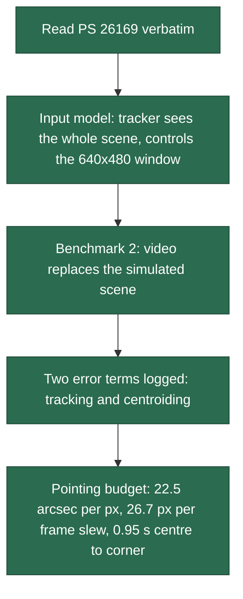
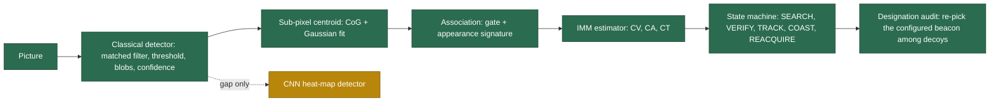
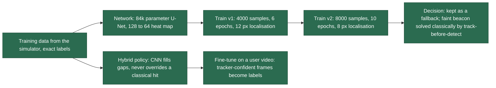
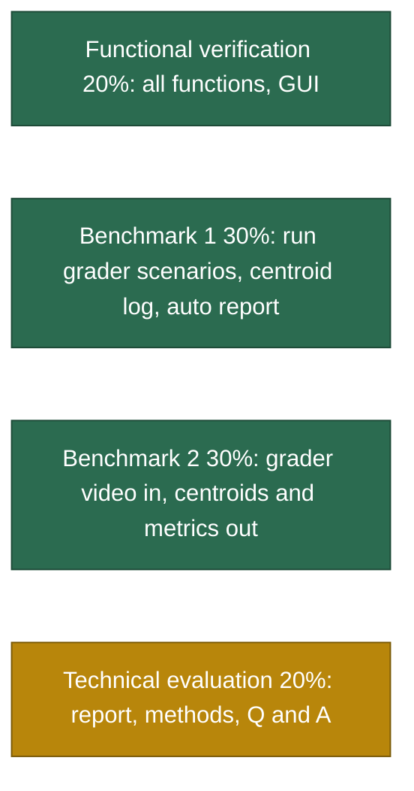

# Progress Pipeline

FSOC Tracker for **SIH26169** (Department of Space / ISRO SAC): AI-based virtual camera tracking
system for coarse alignment of mobile FSOC terminals.

Colour key used in every diagram and table below:

| Colour | Status |
|---|---|
| 🟩 green | Done and verified |
| 🟨 amber | In progress or partly done |
| 🟥 red | Blocked or failing |
| ⬜ grey | Not started |

Last updated: 2026-09-22

---

## 1. The pipeline at a glance

---

## 2. Stage by stage

### 2.1 Understanding the problem  🟩

**What exists today and what goes wrong.** Satellites, drones and ground stations mostly talk
over radio: reliable but slow, licensed, and open to interference. FSOC sends data on a laser
beam instead: gigabit to terabit rates, no licence, immune to interference. The catch is
aiming. A laser is a thin pencil of light, both ends move, so the terminals must keep finding
and following each other (PAT). Coarse alignment gets the beacon into the camera's view;
fine alignment locks the beam. This project is the coarse stage. Building and testing it on
real hardware needs an expensive camera, pan-tilt mount and optics, and on hardware you can
neither order fog on demand, nor know the beacon's true position, nor repeat a test exactly.

**What goes in, what comes out.** The tracker looks at the whole scene picture (the 2000 x 2000
screen with beacon and disturbances). It controls the 640 x 480 camera window, which stands
for where the terminal points and can turn at most 5 to 10 degrees per second. Three
situations: your own run (settings in, live display and report out), Benchmark 1 (grader
scenario files in, centroiding log and report out), Benchmark 2 (grader .mp4 in, per-frame
centre points, RMSE, acquisition and re-acquisition times, lock retention and FPS out).

**Why build our own scene when graders supply a video.** It is a mandatory deliverable (the
first four "shall" items and parameter rows 1 to 15), Benchmark 1 cannot run without it, we
will not have their video while building, and only our own scene knows the true answer.

### 2.2 Simulator  🟩

| Item | Status | Notes |
|---|---|---|
| Scene 2000 x 2000 with starfield, terrain, gradient, flat | 🟩 | rows 1, 2 |
| Beacon shapes square, circle, gaussian; 5 to 20 px | 🟩 | rows 7 to 10 |
| Paths: line, circular, figure of 8, random, spiral, sinusoidal | 🟩 | row 12; line turns back smoothly at edges |
| Rate-limited gimbal with acceleration limit and latency | 🟩 | rows 13 to 15; window centre can reach any screen pixel |
| Disturbances in physical order: extinction, turbulence, blur, platform sway, vibration, Poisson, Gaussian, salt and pepper | 🟩 | rows 21 to 25; sway amplitude capped at 20% of screen so the beacon stays in the field |
| Atmosphere presets clear, haze, fog, rain, low light | 🟩 | row 24 |
| Ground truth per frame, deterministic from (scenario, seed) | 🟩 | |
| Colour camera option | 🟩 | row 2; tracker uses luminance |

### 2.3 Tracker  🟩

| Item | Status | Measured |
|---|---|---|
| Centroiding accuracy | 🟩 | 0.006 to 0.02 px clear, 0.08 fog, 0.18 to 0.19 heavy noise |
| Acquisition | 🟩 | 0.6 to 1.4 s on every full-view scenario (spec 2 s) |
| Vibration handled as measurement noise, not motion | 🟩 | innovation-based, capped at 25 px |
| Identity among decoys | 🟩 | one seed in five swaps in the hardest stress case |
| Hard mode (tracker sees only the window) | 🟩 | square-spiral search; acquisition 3 to 12 s, physics-limited |

### 2.4 Controller  🟩

| Item | Status |
|---|---|
| Feedforward of velocity and acceleration, PID on error, latency lead for target and window | 🟩 |
| Deadband and integrator clamping | 🟩 |
| Saturation reported per frame | 🟩 |

### 2.5 Measured performance (15 s runs)  🟩

| Scenario | Tracking error | Lock | Status |
|---|---|---|---|
| Clear line / circle / figure of 8 | 6.7 to 7.3 px | 100% | 🟩 |
| Clear random | 8 to 11 px | 98% | 🟩 |
| Noise: 10% salt and pepper, sigma 20, Poisson | 7.3 px | 100% | 🟩 |
| Fog | 6.6 px | 100% | 🟩 |
| Low light | 7.0 px | 100% | 🟩 |
| Platform sway 12 px/f + vibration 20 px/f | 20 px raw, 14.6 px vibration removed | 99% | 🟥 physical limit: a random per-frame jitter cannot be cancelled before the frame arrives; the vibration-removed error is reported alongside |
| Platform at PS maximum 20 + 20 px/f | 25 to 27 px (23 vibration removed) | 76 to 88% | 🟥 physical limit: measured the same at the allowed 10 deg/s (slew saturation 2%), so the random 20 px per-frame vibration is the limit, not the motor |
| Multi-target stress with haze, noise, sway | 13.6 to 14.4 px | 98 to 99% | 🟩 identity held on every seed (fitted width, refined association, frozen signature at crossings) |
| Hard mode | 6.5 to 8.9 px after acquisition | 100% | 🟩 acquisition 3 to 12 s |
| Faint beacon at 3 to 6 sigma | 6.7 to 12.3 px | 91 to 97.5% on all 10 seeds | 🟩 track-before-detect on a moving-target residual; acquisition 1.3 to 2.8 s on 9 seeds, 5.5 s on one |

Processing: 65 to 250 FPS at 2000 x 2000 on a laptop CPU (spec 20).

### 2.6 Instrumentation  🟩

| Item | Status |
|---|---|
| `frames.csv`, one row per frame, about 45 columns | 🟩 |
| `summary.json` with every metric and its printed definition, pass/fail against PS rows 16 to 20 | 🟩 |
| `report.pdf`, three pages: spec check, time series, paths and histograms | 🟩 |
| Vibration-removed tracking error alongside the raw one | 🟩 |
| Batch runner with multi-seed envelope table | 🟩 |

### 2.7 Desktop application  🟩

| Item | Status |
|---|---|
| Parameter panel, one control per PS row, tooltips naming the row | 🟩 |
| Scenario picker, speed control, keyboard shortcuts | 🟩 |
| Live specification tiles (green / amber) | 🟩 |
| Scene view with 2 degree grid, trails, legend | 🟩 |
| Camera view with capture ring, error vector, prediction, scale bar | 🟩 |
| Four live plots with legends | 🟩 |
| Benchmark 2 video ingest, with first-frame preview and file facts on load | 🟩 |
| New random seed and heading each run, with a pin option | 🟩 |
| Automatic report on finish, open report / folder; advice when the gimbal was rate-limited | 🟩 |

### 2.8 Tests  🟩

15 tests: geometry, gimbal limits, every motion type on screen and deterministic, centroid
accuracy, sub-pixel refinement, IMM prediction, closed loop clear, closed loop with
vibration, multi-target identity, video path. All pass in about 20 s.

### 2.9 AI detector  🟨

Honest state: on simulated scenes the classical pipeline carries the load and the CNN contributes about 0%
of measurements; on a real phone video it supplied half of them. The faint-beacon case is now handled classically (chains of weak detections on a moving-target residual), so the CNN stays a gap filler.
`training/finetune_from_video.py` adapts it to footage you provide (self-training from the tracker's confident frames).

### 2.10 Executable builds  🟩

Built by `.github/workflows/build.yml` (GitHub Actions matrix). Each job installs the project, runs the
21 tests, the web app smoke test, packages with PyInstaller and runs the packaged executable on a
scenario before uploading the archive. `bash webapp/fetch_builds.sh` pulls the archives into `dist/`,
`bash webapp/deploy.sh` publishes them under /downloads/ on the project site.

| Target | Runner | Status |
|---|---|---|
| Windows x64 (`FSOC-Tracker-windows-x64.zip`, with `FSOC-Tracker-cli.exe`) | windows-latest | 🟩 tests, web smoke and packaged smoke passed on the runner; archive contents inspected |
| Linux x64 (`FSOC-Tracker-linux-x64.tar.gz`, glibc of Ubuntu 22.04) | ubuntu-22.04 | 🟩 tests, web smoke and packaged smoke passed on the runner; archive contents inspected |
| macOS Intel (`FSOC-Tracker-macos-intel.zip`) | macos-15-intel | 🟩 runner checks passed; archive also run by hand under Rosetta 2: two scenarios, video mode, GUI start |
| macOS Apple silicon (`FSOC-Tracker-macos-arm64.zip`) | macos-14 | 🟩 runner checks passed; archive also run by hand natively: two scenarios, video mode, GUI start |

Native code per platform is unavoidable: the bundles carry NumPy, OpenCV, SciPy, Qt and ONNX Runtime.
The web app is the architecture-neutral path.

### 2.11 Documents  🟩

| Document | Status |
|---|---|
| `COMPLIANCE.md`, point-by-point check of every PS row, shall item, deliverable and evaluation stage, backed by `tests/test_ps_compliance.py` | 🟩 |
| Progress website (`web/`), served from the project server at /about/ | 🟩 |
| Web app (`webapp/`), same engine in the browser, served at the project site root with a desktop download prompt | 🟩 |
| Desktop builds for Windows x64, Linux x64, macOS Intel and Apple silicon (`.github/workflows/build.yml`, tests and smoke test per OS) | 🟩 |
| `docs/USER_MANUAL.md` and `.pdf` | 🟩 |
| `docs/TECHNICAL_REPORT.md` and `.pdf` | 🟩 performance table filled from the measured envelope |
| `ARCHITECTURE.md` | 🟩 |
| `docs/plan.html` (plain-English briefing, open locally in a browser) | 🟩 |
| Demo video, 3 to 5 min (optional in the PS) | ⬜ |

### 2.12 Submission  🟨

| Item | Status |
|---|---|
| Source with documentation | 🟩 |
| Standalone executable for the evaluators' machines | 🟩 four archives on the project site |
| Technical report 10 to 15 pages, exported | 🟩 12-page PDF |
| User manual, exported | 🟩 PDF, per-platform installation |
| Web app for review without installation | 🟩 project site, login protected |
| Demo video (optional) | ⬜ |
| Rehearsed 10 to 15 minute live demo script | ⬜ |

---

## 3. Where the marks are, and where we stand

Benchmark 1 and 2 are marked green because the mechanisms exist and are tested; the grader
files themselves arrive at judging.

---

## 4. Key numbers behind the design

One assumption: one screen pixel equals one camera pixel, so the 2000 px screen is 12.5 degrees.

| Quantity | Value |
|---|---|
| One pixel | 22.5 arcsec (4 deg / 640 px) |
| Allowed tracking error | 10 px = 0.0625 deg |
| Window motion at 5 deg/s, 30 Hz | 26.7 px per frame |
| Platform motion at PS maximum | 20 px per frame = 75% of the slew budget |
| Windows per screen | about 13 |
| Centre to corner, target known | 0.95 s |

---

## 5. Open items, in priority order

1. 🟩 CNN kept as a fallback; report's performance table filled from the measured envelope.
2. 🟩 Windows, Linux, macOS Intel and Apple silicon builds from the build workflow, package-checked on each platform.
3. 🟩 Technical report and user manual exported to PDF; demo video composed from the engine (`tools/make_demo_video.py`); demo script in `docs/DEMO_SCRIPT.md`.
4. 🟩 Multi-target identity: candidates ranked by fitted width (noise-independent) instead of blob area; the stress seed that swapped now holds 99% lock.
5. 🟩 Faint beacon: track-before-detect on a moving-target residual; 10 seeds all hold 91 to 97.5% lock, acquisition under 2.8 s on nine of them.
