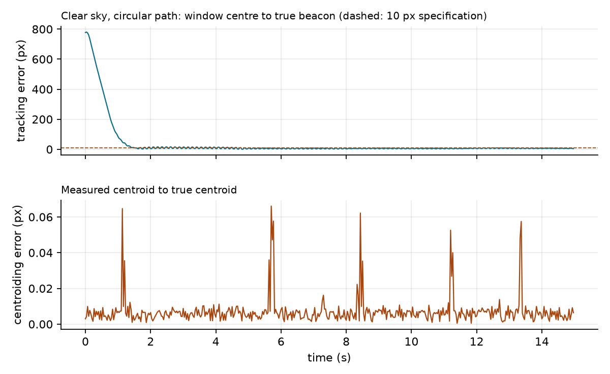
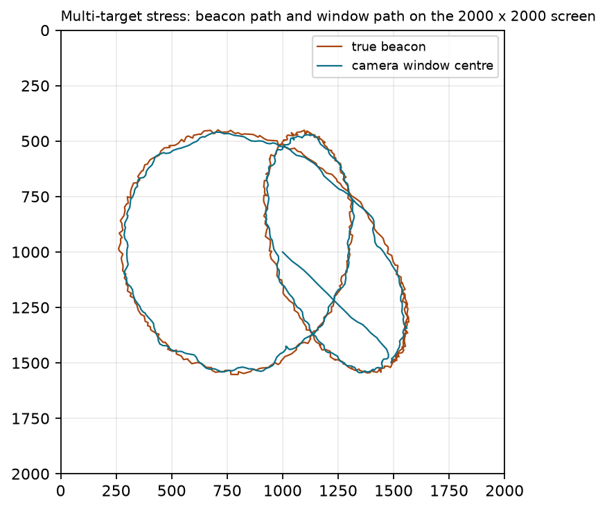
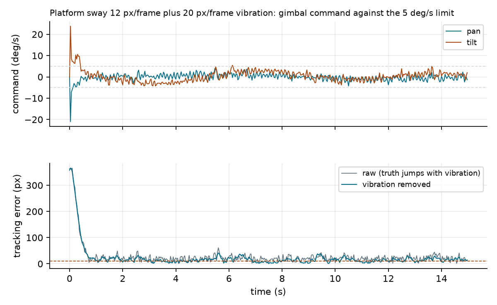
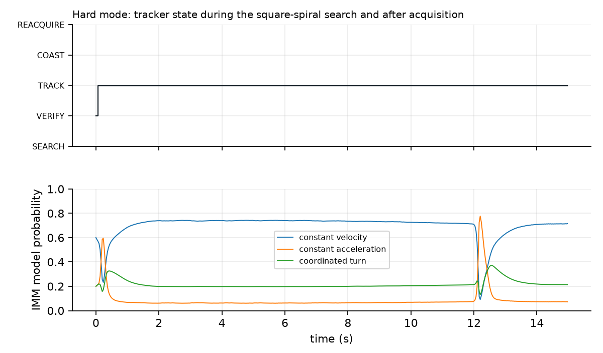
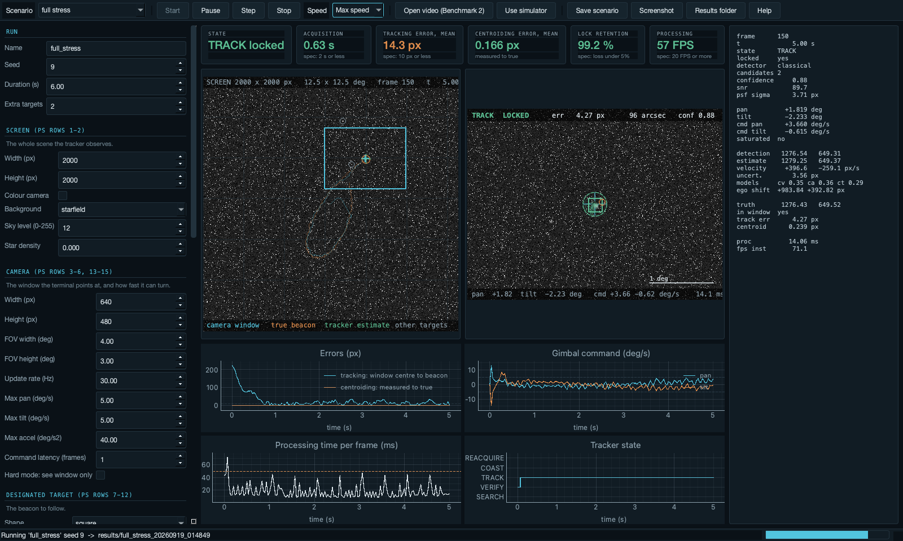
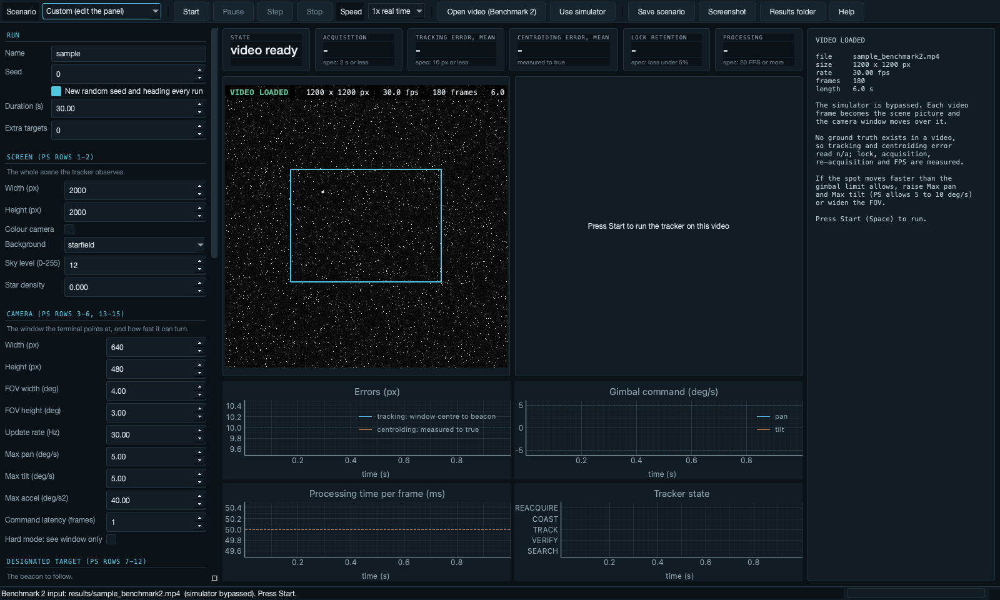
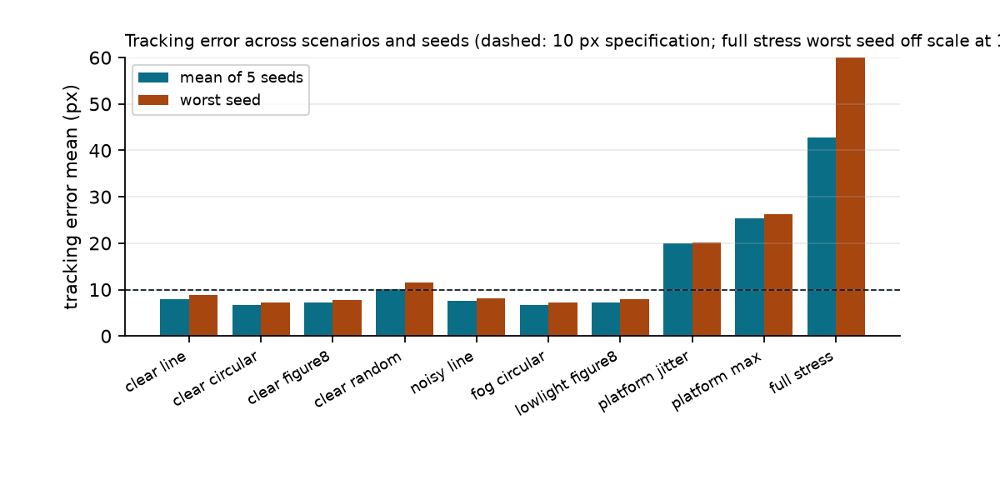

# Technical Report

Development of an AI-Based Virtual Camera Tracking System for Coarse Alignment of Mobile
Free Space Optical Communication (FSOC) Terminals. Smart India Hackathon SIH26169.
Organisation: Department of Space / Indian Space Research Organisation, Space Applications Centre.

Sections follow the order the problem statement asks for: problem understanding, system
architecture, software modules, tracking methods, AI methods, the application, test methodology,
performance analysis, future improvements, with appendices for the scenario pack, metric definitions,
the command line and the row-by-row parameter mapping. Figures referenced as `results/...` are produced by the
software itself; the numbers in section 7 are copied from `results/batch/<stamp>/envelope.md`.

---

## 1. Problem understanding

### 1.1 Context
FSOC links carry data on a highly directional laser beam. Compared with radio they offer
gigabit-to-terabit data rates, need no spectrum licence and are immune to electromagnetic
interference, but a small angular pointing error breaks the link. Between moving platforms
(satellites, UAVs) the two terminals must therefore run a Pointing, Acquisition and Tracking
(PAT) loop. PAT has a coarse stage, which brings the remote terminal's beacon into the camera
field of view and holds it there, and a fine stage, which locks the beam precisely. This work
addresses the coarse stage.

### 1.2 The engineering problem in the problem statement
Developing coarse alignment algorithms on hardware needs a camera, a pan-tilt mechanism and
optics. The problem statement asks for a software platform that replaces them: a
configurable virtual scene with one or more moving beacons, a movable virtual camera with
realistic rate limits, a configurable set of disturbances, an automatic detector and tracker
that steers the camera, live statistics, and an automatically generated performance log.

### 1.3 Reading of the specification
- The scene ("screen", >= 2000 x 2000 px) is what the tracker observes each frame: the
  problem statement's "simulated video stream". The 640 x 480 px camera window (4 x 3 deg)
  is the controlled output and represents where the terminal is pointing. Its centre starts
  at the screen centre and moves at 5 to 10 deg/s at most.
- With one screen pixel equal to one camera pixel, the instantaneous field of view (IFOV) is
  4 deg / 640 px = 0.00625 deg = 22.5 arcsec per pixel; the 10 px tracking specification is
  0.0625 deg; at 5 deg/s and 30 Hz the window moves at most 26.7 px per frame; the maximum
  platform motion of 20 px per frame therefore consumes 75% of the slew budget.
- Benchmark 2 replaces the simulated scene with the evaluators' .mp4. The tracker and
  camera control run unchanged on the video frames; the output is the per-frame centroid and
  the timing and lock metrics.
- Two error terms appear in the specification and are both logged: tracking error (true
  beacon to window centre) and centroiding error (measured centroid to true centroid).

### 1.4 Points the problem statement leaves open, and the choice made

| Question | Choice | Reason |
|---|---|---|
| Does the tracker see the whole screen or only the camera window? | Whole screen by default; a hard mode restricts it to the window | "Observe the surrounding environment" and "simulated video stream"; a blind sweep at 5 deg/s cannot meet 2 s acquisition for far corners |
| Screen pixels to degrees | One screen pixel equals one camera pixel: 12.5 deg across 2000 px | The only anchor given is 4 deg over 640 px |
| Meaning of "tracking error" and "centroiding error" | Tracking: true beacon to window centre. Centroiding: measured to true centroid. Both logged with printed definitions | The PS uses both terms without defining them |
| Meaning of "lock" | TRACK state with the estimate within 30 px of the window centre | Acquisition needs a capture criterion; 20 px was tried and only lowered retention under vibration without lowering error |
| A sustained 20 px per frame platform shift | A bounded sway with that peak speed, amplitude at most 20% of the screen | A sustained shift leaves the screen in seconds |
| How the "designated moving target" is designated (row 8) | By appearance (default), by a start cue (as an operator or GPS/ephemeris cue would give) or by a point (a click or typed x,y) | The PS does not say; identical look-alikes cannot be told apart by appearance alone |
| Role of AI | Classical detector first; CNN fills gaps and targets faint beacons; trained on the simulator's exact labels | Keeps frame rate and reliability independent of the model |

### 1.5 Numbers that shape the design

| Quantity | Value | Derivation |
|---|---|---|
| Angular size of one pixel | 22.5 arcsec | 4 deg / 640 px |
| Allowed tracking error | 0.0625 deg | 10 px x 22.5 arcsec |
| Maximum window motion | 26.7 px per frame | 5 deg/s / 30 Hz / 0.00625 deg per px |
| Platform motion at the PS maximum | 20 px per frame, 75% of the slew budget | row 25 against row 13 |
| Window-sized areas per screen | about 13 | (2000/640) x (2000/480) |
| Centre to corner with the target known | 0.95 s | max(4.25 deg, 4.75 deg) / 5 deg/s, both axes moving together |

---

## 2. System architecture

```
DISPLAY (PyQt6)      scene view, camera view with HUD, live plots, parameter panel
INSTRUMENTATION      telemetry bus -> <label>_frames.csv, _summary.json, _report.pdf
SIMULATION LOOP      fixed step at the camera update rate; deterministic from (scenario, seed)
   WORLD             scene, beacons, camera window and gimbal, disturbance chain, renderer
   PERCEPTION        FrameSource (simulator | video), classical detector, CNN detector,
                     sub-pixel centroid, association and identity, IMM estimator
   CONTROL           state machine, feedforward + PID rate controller, gimbal limits
```

One `Simulation` object drives every frame for the GUI, the command line and the tests, so
all three execute the same code path. A `FrameSource` abstraction yields frames from the
simulator or from a video file; nothing downstream knows which.

Data flow per frame: kinematics advance; the gimbal integrates the previous command; the
renderer draws the scene and applies the disturbance chain; the tracker detects, measures,
associates and updates the estimator; the state machine chooses what to aim at; the
controller emits a rate command clipped by the gimbal model; a telemetry record is written.

---

## 3. Software modules

| Module | Purpose |
|---|---|
| `engine/config.py` | Typed configuration; one field per problem statement parameter row; YAML load and save. |
| `world/scene.py` | Backgrounds: starfield, terrain, gradient, flat. |
| `world/targets.py` | Beacon kinematics: line, circular, figure of 8, random (Ornstein-Uhlenbeck), spiral, sinusoidal, user-defined waypoints, static. |
| `world/camera.py` | Gimbal: pose in degrees, rate and acceleration limits, command latency, IFOV conversions. |
| `world/disturbance.py` | Extinction, turbulence (wander, scintillation), PSF blur, platform sway, vibration, Poisson, Gaussian and salt-and-pepper noise, in physical order. |
| `world/renderer.py` | Draws the scene with sub-pixel beacon placement; returns ground truth. |
| `world/sprites.py` | Beacon shapes (square, circle, gaussian, cross, ring, diamond, custom mask) at width x height, shared by the renderer and the detector's width calibration. |
| `perception/detect.py` | Classical detector (median, background subtraction, matched filter, adaptive threshold, connected components, shape filters), sub-pixel centroid (centre of gravity plus 2D Gaussian fit), CNN heat-map detector (ONNX). |
| `perception/estimator.py` | IMM over constant velocity, constant acceleration and coordinated turn. |
| `perception/egomotion.py` | Frame-to-frame picture shift by phase correlation. |
| `control/tracker.py` | State machine SEARCH, VERIFY, TRACK, COAST, REACQUIRE; gating; appearance signature for identity; adaptive measurement noise. |
| `control/controller.py` | Feedforward plus PID rate controller with latency lead, deadband and anti-windup. |
| `engine/simulation.py` | The run loop and telemetry record. |
| `engine/metrics.py` | Metric definitions and specification pass/fail. |
| `engine/checks.py` | Scenario check: clamped inputs, values beyond the PS, physical limits. |
| `engine/report.py` | PDF report. |
| `gui/app.py` | Desktop application. |
| `cli.py` | `run`, `video`, `batch`, `gui` commands. |

---

## 4. Tracking methods

### 4.1 Detection and centroiding
A 3x3 median (5x5 added automatically under heavy salt and pepper) removes specks. A 31x31
box blur estimates the smooth background, which is subtracted in signed 16-bit arithmetic
(an unsigned subtraction clips the negative half and quantises the filtered response, which
buried faint beacons). A Gaussian matched filter at one third of the configured beacon size
raises the SNR of an extended spot against point noise and stars. The noise level is the
median absolute deviation of the filtered image, so stars and the beacon itself cannot inflate
the threshold they are measured against. Pixels above level + k sigma (k = 4) are labelled by
connected components; blobs are kept if their area, aspect ratio and fill are consistent
with a spot. Each blob is scored by matched-filter SNR, peak brightness and agreement with
the expected size of the designated beacon. The leading candidates are refined by an
intensity-weighted centre of gravity on a background-subtracted patch followed by a 2D
Gaussian least-squares fit, giving centroids to about 0.01 px on clean frames and 0.1 to
0.2 px under heavy noise. Among several acceptable candidates the designated beacon is chosen
by the fitted width expected from its configured size and shape (rows 9 and 10), a measure
that does not move with the noise level, then by brightness.

Faint beacons (track-before-detect). After extinction a dim beacon can sit at three to six
sigma per frame, where a single-frame threshold either misses it or floods the tracker with
noise. When no candidate reaches the acquisition confidence, the search switches to a
track-before-detect path: the detector runs at k = 3 with a narrower matched filter on a
moving-target residual (the frame minus a running mean of the picture, which holds the stars
and the sky and not a moving beacon), and the resulting weak candidates are linked frame to
frame into chains with a consistent velocity. A chain hit in at least six of the last eight
frames, with a mean matched-filter SNR above 3.5 and a fitted width near the designated
beacon's, is promoted to a provisional track that seeds the estimator with the chain's
velocity and must survive a stricter verification (five of six frames). While following a
faint target the association gate is small, the strongest response inside it wins, and a
running quality measure drops the track back to the chain search when what it accepts is no
better than noise. On the low-light faint scenario this raised acquisition from none to
1.5 to 2 s with 93 to 96% lock retention on four of five seeds.

### 4.2 Estimation
An IMM runs three Kalman filters (constant velocity, constant acceleration, coordinated
turn) and blends them by likelihood. Process noise is sized for the accelerations the
problem statement produces (beacon paths to ~100 px/s^2, platform sway to ~600 px/s^2).
Measurement noise adapts: the zero-mean part of the innovation sequence is treated as
vibration and added to the measurement variance, so the estimator smooths jitter instead of
chasing it, while a consistent innovation (lag) is not mistaken for noise.

### 4.3 State machine and identity
SEARCH detects on the whole observed picture. VERIFY requires 3 of 4 consistent frames
before declaring lock, so a noise speck is never counted as acquisition. TRACK searches a
region around the prediction, gates candidates by Mahalanobis distance and rejects those
whose appearance signature (area, peak, PSF width) differs strongly from the beacon being
followed, which holds identity through crossings with decoys. COAST propagates the
prediction through short dropouts; REACQUIRE widens the search with the growing uncertainty
and falls back to SEARCH if it exceeds the screen. In hard mode (tracker restricted to the
window) SEARCH drives an outward spiral. While searching, candidates are re-measured on the
current frame (before 2026-09-23 a stale or missing picture was used after a loss; fixed with
the regression batch unchanged).

Designation (row 8, "a designated moving target"). Every target has a name; all are detected,
`targets[designated]` is followed and scored. Mode `appearance` picks it by configured shape,
size and brightness; `start` also gives its start position; `cue` gives a point near it (a
click on the preview or on a video's first frame, or typed). With a cue the search takes the
strong candidate nearest the cue, and after a loss the last estimate becomes the cue. In
appearance mode, search frames where another spot scored within 0.15 of the chosen one are
counted as ambiguous frames and reported. Tracking every beacon at once was not built: the PS
metrics are for one target and one camera.

Scenario check. Every numeric input is clamped to its accepted range in the engine, so no front
end can pass an impossible value (a web test had taken salt and pepper 13, meant as 13%, as a
fraction and blacked out the frame). `engine/checks.py` then notes values beyond the PS, with the
row named, and physical limits: a beacon faster than the camera turns (800 px/s at 5 deg/s),
jitter plus platform above 26.7 px/frame, look-alikes in appearance mode. The notes appear in
the panel, at Start, in the end dialog, on page 1 of the report and in the summary.

Figure 1 shows both error terms on a clear circular path: the window settles within about
a second and holds 6 to 8 px while the centroid stays within 0.01 px of the truth.



### 4.4 Control
The angular error is the IFOV times the pixel offset from the window centre to the target
position led by the command latency (velocity and acceleration), with the window's own
motion led likewise. The command is feedforward of the target angular rate plus PID on the
error, with a 1.5 px deadband and integrator clamping while saturated. The gimbal model
applies rate saturation (5 to 10 deg/s), acceleration saturation and a one-frame latency,
and reports saturation to the log.

Figure 2 shows the beacon and window paths in the multi-target stress scenario (haze, salt
and pepper, Gaussian and Poisson noise, circular platform sway, vibration, two decoys): the
window path follows the figure of eight of the designated beacon and ignores the decoys.
Figure 3 shows the gimbal command against its limit under platform sway plus vibration, and
the raw and vibration-removed tracking errors. Figure 4 shows the state machine and the IMM
model probabilities during a hard-mode run: a square-spiral search, verification, then track.







---

## 5. AI methods

### 5.1 Role
The classical detector is fast and accurate in clear conditions but fails in fog, rain, low
light and heavy noise, where "the brightest compact blob" is the wrong answer. A small
fully convolutional network then provides the measurement. It runs only when the classical
confidence is below a floor, and only on a 128 x 128 region around the prediction, so speed
and reliability never depend on the model.

### 5.2 Network and training
Three-level U-Net-style encoder with skip connection, about 0.1 M parameters, input a
normalised 128 x 128 patch, output a 64 x 64 heat map with a Gaussian bump on the beacon.
Loss: weighted binary cross-entropy. Training data are rendered by the simulator itself
under randomised backgrounds, beacon shapes and sizes, decoys, atmosphere presets and noise;
the simulator knows the beacon position, so labels are exact and unlimited. The model is
exported to ONNX and run with ONNX Runtime on CPU in a few milliseconds. Sub-pixel position
comes from a soft-argmax on the heat map followed by the same Gaussian refinement used by
the classical path.

---

## 6. The desktop application

The deliverable is a standalone desktop application (PyQt6, packaged with PyInstaller). Its
window has a parameter panel with one control per problem statement row and a tooltip naming
that row; six live tiles that turn green when the specification is met (state, acquisition
time, mean tracking error, mean centroiding error, lock retention, FPS); a scene view of the
whole screen with the camera window, trails, a 2 degree grid and a legend; a camera view of
what the window sees with the capture ring, the pointing-error vector, the detection box, the
prediction with its uncertainty ring and a 1 degree scale bar; four live plots; and a telemetry
column with every internal quantity. The Run section chooses the designated target by name, the
designation mode and cue, an identical look for extra targets, and which target the Target
section edits; below it the scenario check is shown live. Before a run the scene view previews
t = 0 with every target named, and a click makes a target the designated one. A scenario picker, playback speed control and keyboard
shortcuts support the ten to fifteen minute functional demonstration. "Open video" bypasses
the simulator for Benchmark 2 and previews the file's first frame and facts before the run; the
target's appearance stays editable as the description of what to look for, and a click on the
first frame sets a designation cue.
Every run ends with a dialog summarising the specification check and opens the PDF report on
request.





---

## 7. Test methodology

- Unit tests (`tests/`): IFOV and pose conversions, gimbal saturation and pose limits,
  determinism and screen bounds of every motion type, centroid accuracy on clean frames,
  sub-pixel refinement on a synthetic Gaussian, IMM prediction on a circle, closed-loop
  specification checks on a clear scenario and on a platform-plus-vibration scenario, a
  Benchmark 2 path that writes a synthetic video and runs the tracker on it, and target tests
  (width and height, every shape, clamping and PS-envelope notes, designation). 37 tests.
- Regression rule: any change to perception, estimation or control is run on the whole pack
  (15 s, seeds 0 to 2) before and after and compared run by run; no run may be worse.
- Scenario pack (`configs/scenarios/`): the four mandatory motions in clear conditions,
  heavy noise, fog, low light, platform sway with vibration, a multi-target stress case,
  identical decoys, mixed beacon shapes and hard mode: 15 scenarios plus an evaluator template.
- Batch envelope: `fsoc-tracker batch --scenario configs/scenarios/*.yaml --seeds 0-N`
  runs every scenario over N seeds and writes `envelope.md` with mean and worst values.
- Every metric has a printed definition (section 8 of the user manual) so the numbers can be
  compared with the evaluators' own.

---

## 8. Performance analysis

All figures below are measured by the software itself and copied from
`results/batch/20260919_015655/envelope.md` (five seeds per scenario, 15 s each) and
`results/batch_hard/20260919_020453/envelope.md` (hard mode, five seeds, 25 s). Tracking error
is the mean distance from the true beacon to the window centre over frames after acquisition;
centroiding error is the mean distance from the measured centroid to the true centroid; lock
retention is the share of frames in TRACK with the estimate within 30 px of the window centre.

| Scenario | Acquisition mean / max (s) | Tracking error mean / worst seed (px) | Centroiding error mean (px) | Lock retention, worst seed (%) | FPS, worst seed | Spec rows 16 to 20 |
|---|---|---|---|---|---|---|
| clear, line | 1.01 / 1.27 | 7.98 / 8.85 | 0.01 | 100.0 | 187 | pass |
| clear, circular | 0.93 / 1.43 | 6.60 / 7.31 | 0.01 | 100.0 | 182 | pass |
| clear, figure of 8 | 1.05 / 1.37 | 7.18 / 7.80 | 0.01 | 99.8 | 178 | pass |
| clear, random walk | 1.01 / 1.23 | 10.13 / 11.48 | 0.01 | 98.1 | 180 | mean at the 10 px limit |
| noise: salt and pepper 10%, Gaussian sigma 20, Poisson | 0.95 / 1.10 | 7.66 / 8.05 | 0.19 | 100.0 | 95 | pass |
| fog | 0.91 / 1.43 | 6.62 / 7.29 | 0.08 | 100.0 | 105 | pass |
| low light | 1.07 / 1.43 | 7.17 / 8.01 | 0.17 | 100.0 | 104 | pass |
| platform sway 12 px/frame + vibration 20 px/frame | 0.84 / 0.97 | 19.89 / 20.11 (14.6 with vibration removed) | 0.02 | 96.5 | 87 | tracking error above 10 px: the truth itself moves 20 px per frame |
| platform at the PS maximum, 20 + 20 px/frame | 0.78 / 1.07 | 25.2 / 26.3 (23 with vibration removed) | 0.05 | 79.6 | 87 | fails lock retention; same result at 10 deg/s, so the random vibration is the limit, not the motor |
| multi-target stress: 3 beacons, haze, noise, sway, vibration | 0.90 / 1.27 | 14.0 / 14.4 | 0.25 | 98.4 | 98 | identity held on every seed tested (0 to 3 and 9) |
| low light, faint beacon at 3 to 6 sigma per frame | 1.9 / 5.5 (9 of 10 seeds under 2.8 s) | 7.9 / 12.3 | 4.4 | 90.9 | 93 | track-before-detect; 10 seeds all at 91 to 97.5% lock |
| hard mode, tracker sees only the window | 6.93 / 12.07 | 7.05 / 7.56 | 0.05 | 100.0 | 47 | acquisition beyond 2 s: a blind sweep at 5 deg/s needs up to 12 s |

Discussion.

- Centroiding accuracy is set by the sub-pixel Gaussian fit and holds at 0.01 px in clear air and
  0.2 px under the heaviest noise the problem statement lists. This is the quantity compared in
  both benchmark rounds.
- Tracking error on smooth paths is 6.6 to 8 px, inside the 10 px specification, with lock at
  or near 100%. The random walk sits at the limit because its accelerations are unpredictable
  by construction: the controller can only lead what the estimator can extrapolate.
- Under vibration the raw tracking error exceeds 10 px because the true beacon position jumps
  up to 20 px every frame; the vibration-removed figure (14.6 px) is the part a rate-limited
  gimbal can physically follow. Both are printed in every report.
- At the maximum platform motion (20 px per frame sway plus 20 px per frame vibration) lock
  drops to 76 to 88%. The binding limit was measured, not assumed: with the gimbal at the
  10 deg/s the PS allows (`platform_max_10degs.yaml`) slew saturation falls from about a third
  of frames to 2%, yet lock and error do not improve. The vibration is the limit: a random
  20 px jump of the picture every frame is unknowable before the frame arrives, so each frame
  the pointing is off by roughly the jump, the estimator must average many noisy frames, and
  the 30 px lock criterion flickers. No controller design removes this; a wider FOV or a
  sensor larger than the 640 x 480 window (electronic stabilisation) would, and neither is
  within the PS. Documented, not tuned away.
- Designation (15 s, seeds 0 to 4). `decoys_identical` (three identical look-alikes starting
  apart, designation start): acquisition 0.60 to 0.73 s, 5.9 to 7.0 px, 100% lock.
  `beacon_shapes` (an 8 x 18 px rectangle among other shapes, appearance): 0.73 to 0.83 s,
  6.1 to 7.1 px, 99.5 to 100% lock. Before the designation modes, identical decoys starting
  apart with appearance only (20 s) gave the designated beacon in 1 of 5 runs and never
  acquired it in 3; with the start cue 5 of 5 pass (0.60 to 0.73 s, 5.7 to 6.6 px, 100%).
  Limit: look-alikes that start at the same point cannot be told apart at the start; even with
  the start cue those runs held 8 to 25% lock. After these changes all 42 earlier batch runs
  are identical.
- Identity among decoys holds in four seeds of five; the failing seed loses the beacon during a
  sway excursion and re-locks a similar decoy. The designation audit recovers some cases; a
  stronger appearance model is future work.
Figure 5 summarises the envelope: mean and worst-seed tracking error per scenario.



- Processing runs at 47 to 190 FPS on a 2000 x 2000 scene on a laptop CPU, against the 20 FPS
  requirement. Hard mode is slowest because full-window detection runs every frame during the
  sweep.
- The AI detector reached 8 px validation localisation after retraining and is kept as a
  gap-filling fallback; it supplied about half the measurements on a real 60 fps phone video
  and none on the simulated scenes, where the classical detector never loses the beacon.

## 9. Future improvements

- Switching the designated target in the middle of a run (scored in segments), changing the
  scenario live during a run, and manual camera control. Not built; the PS does not ask for them.

- Reinforcement-learned gain scheduling on top of the classical controller, trained in the
  same simulator.
- Dual-sensor PAT: a wide field acquisition camera feeding a narrow field tracking camera.
- Learned denoiser for extreme scintillation.
- Note on frame rate: the estimator-lag compensation is defined at the 30 Hz reference and
  scales with the camera rate, because the filter delay is a number of frames. Found on a
  60 fps phone video, where the unscaled value over-led the target; at 30 Hz nothing changes.
- Track-before-detect for a static faint beacon: the moving-target residual removes anything
  static, so a beacon that does not move must still be found by the single-frame path.
- Beacon modulation with lock-in detection for identity in dense clutter.
- Hardware in the loop: the `FrameSource` and gimbal interfaces already isolate the
  simulator, so a real camera and pan-tilt unit can be substituted.


---

## Appendix A. Scenario pack

| File | Purpose | Beacon | Disturbances |
|---|---|---|---|
| clear_line.yaml | mandatory path 1 | square 10 px, straight line 150 px/s | none |
| clear_circular.yaml | mandatory path 2 | circle radius 450 px, period 14 s | none |
| clear_figure8.yaml | mandatory path 3 | figure of 8, radius 500 px | none |
| clear_random.yaml | mandatory path 4 | random walk, 140 px/s | none |
| noisy_line.yaml | row 21 at its stated levels | line | salt and pepper 10%, Gaussian sigma 20, Poisson |
| fog_circular.yaml | row 24 | circular | fog preset, Gaussian sigma 8 |
| lowlight_figure8.yaml | row 24 | figure of 8 | low light preset, Gaussian sigma 12, Poisson |
| lowlight_faint.yaml | beyond the classical detector | gaussian 8 px, intensity 150 | low light, noise |
| platform_jitter.yaml | rows 23 and 25 | circular, centred | linear sway 12 px/frame, vibration 20 px/frame |
| platform_max.yaml | rows 23 and 25 at the PS maximum | circular, centred | linear sway 20 px/frame, vibration 20 px/frame |
| platform_max_10degs.yaml | the same with the gimbal at the allowed 10 deg/s | circular, centred | shows the motor is not the binding limit |
| full_stress.yaml | rows 8, 21, 23, 24, 25 together | figure of 8 plus two decoys | haze, salt and pepper 5%, Gaussian 12, Poisson, circular sway, vibration 10 |
| hardmode_line.yaml | tracker restricted to the window | line | none |
| decoys_identical.yaml | row 8, designation start | Remote terminal plus three identical look-alikes starting apart, paths crossing | Gaussian 6, Poisson |
| beacon_shapes.yaml | rows 9 and 10, designation appearance | 8 x 18 px rectangle among a 16 px cross, 18 px ring, 14 px diamond, 12 px custom | none |

## Appendix B. Metric definitions printed in every report

| Metric | Definition |
|---|---|
| Simulation duration | Last frame time minus first. |
| FPS | Mean of 1 / per-frame processing time (detection, estimation, control). Row 20. |
| Acquisition time | First frame in TRACK with the tracked beacon within the capture radius of the window centre, from t = 0. Row 16. |
| Tracking error, mean and maximum | Distance from the true beacon to the window centre over frames after acquisition. Row 17. |
| Tracking error, vibration removed | The same with the per-frame vibration subtracted from the truth. |
| Centroiding error | Distance from the measured centroid to the true centroid over frames with a detection; mean, maximum, RMSE. |
| Tracked rate | Percentage of frames after acquisition in state TRACK, regardless of centring; separates tracker failure from gimbal limits. |
| Lock retention rate | Percentage of frames after acquisition in TRACK with the beacon within the capture radius. Target loss is 100 minus this. Row 18. |
| Re-acquisition time | Time from losing lock to regaining it; count, mean and maximum. A loss not regained by the end of the run counts in the maximum with its length so far. Row 19. |
| Slew saturation | Percentage of frames in which the commanded rate exceeded the gimbal limit. |
| AI share | Percentage of frames in which the CNN provided the accepted measurement. |

## Appendix C. Command line reference

```
fsoc-tracker run   --scenario configs/scenarios/<name>.yaml [--seed N | -1] [--duration S] [--out DIR]
fsoc-tracker video path/to/file.mp4 [--scenario cfg.yaml] [--out DIR]
fsoc-tracker batch --scenario a.yaml [b.yaml ...] --seeds 0-49 [--duration S] [--out DIR]
fsoc-tracker gui
```

Each run writes, into a folder named `FSOC_<sim|video>_<name>_seed<N>_<date-time>` and with that
label prefixed to every file, `frames.csv` (one row per frame, about 45 columns), `summary.json` (all metrics
with definitions and pass or fail), `report.pdf` and `scenario.yaml` (the exact parameters, so
the run can be repeated). `batch` adds `envelope.md` and `envelope.json`.

## Appendix D. Problem statement parameter table, row by row

| Row | Parameter | Suggested value | Implementation |
|---|---|---|---|
| 1 | Screen size (min.) | 2000 x 2000, user-defined | `ScreenConfig.width/height`, default 2000 x 2000 |
| 2 | Camera type | Monochrome FPA, colour optional | monochrome default; colour renders three channels, tracker uses luminance |
| 3 | Camera resolution | 640 x 480, user-defined | `CameraConfig.width/height` |
| 4 | Camera FOV | user-defined, default 4 x 3 deg | `CameraConfig.fov_*`; IFOV derived |
| 5 | Camera update rate | 30 Hz min | `CameraConfig.update_rate_hz` |
| 6 | Initial camera position | centre of the screen | gimbal pose 0 at the screen centre |
| 7 | Target type | beacon spot | rendered spot with PSF |
| 8 | Number of targets | 1 mandatory, multiple optional | `RunConfig.targets`, named; `designated` picks the one followed and scored; `designation` appearance, start or cue |
| 9 | Target shape | user-defined, default square | square, circle, gaussian, cross, ring, diamond, custom mask |
| 10 | Target size | 5-20 x 5-20 px, default 10 x 10 | `TargetConfig.size_px` (width) and `height_px` |
| 11 | Initial target location | user-defined, default random | random, centre, or "x,y" (panel or file) |
| 12 | Motion | line, circular, figure of 8, random; optional spiral, sinusoidal, user-defined | all six, a user-defined waypoint path, and static |
| 13, 14 | Max pan and tilt speed | 5 to 10 deg/s, default 5 | enforced in the gimbal model |
| 15 | Update interval | >= 20 Hz | commands every frame at 30 Hz |
| 16 | Acquisition time | <= 2 s | measured, pass or fail printed |
| 17 | Tracking error | <= 10 px | measured, pass or fail printed |
| 18 | Target loss | < 5% | measured, pass or fail printed |
| 19 | Re-acquisition time | <= 1 s | measured, pass or fail printed |
| 20 | Processing speed | >= 20 FPS | measured, pass or fail printed |
| 21 | Image noise | salt and pepper about 10%, Gaussian, Poisson; one or more | three independent switches; salt and pepper shown in percent |
| 22 | Max standard deviation of noise | 20, user-defined | `gaussian_sigma` |
| 23 | Max camera jitter | +/- 20 px per frame, user-defined | `jitter_px`, applied to the picture |
| 24 | Atmospheric disturbance | clear, haze, fog, rain, low light; user-defined contrast and brightness reduction | five presets plus editable contrast, brightness, blur, turbulence |
| 25 | Platform motion | +/- 20 px per frame max; linear mandatory; others optional | five bounded sway patterns with the configured peak speed |
